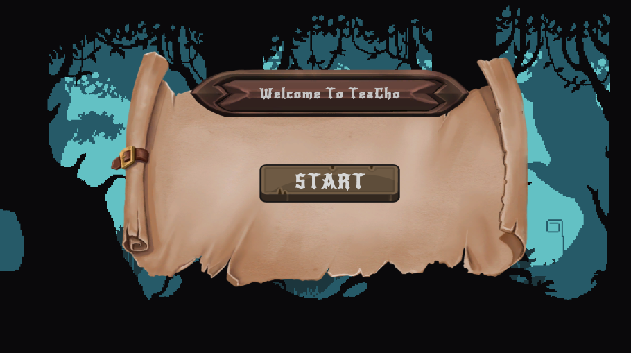
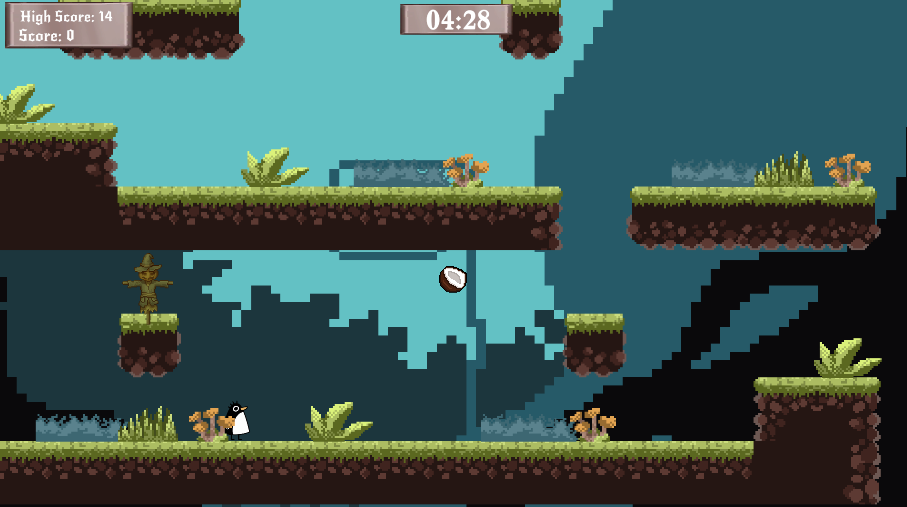
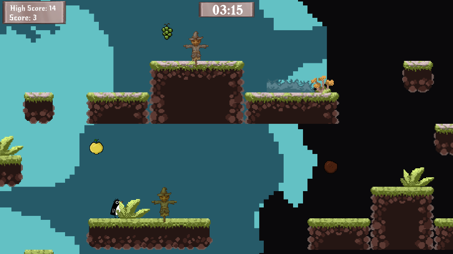
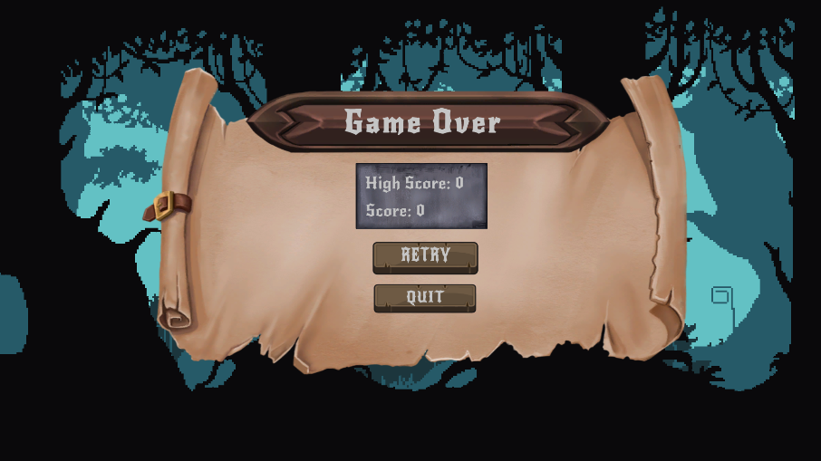

# TeaCho 2D Platformer Game 🎮

TeaCho is a 2D game built with Unity, utilizing **Tilemap** and other necessary assets. The primary goal of the game is to achieve the **highest score possible** by collecting fruits scattered across the map. The game incorporates colorful mechanics, including **teleportation gates** that make navigation exciting and strategic.

## 📜 Game Features

- **Tilemap-Based Gameplay:** Designed with Unity's Tilemap feature for smooth and visually appealing levels.
- **Fruit Collection:** Collect fruits to earn points and increase your score.
- **Color-Coded Gates:**
  - Navigate through gates (railings) to reach different areas.
  - Each gate has a specific color (Red, Blue, Green).
  - Entering a gate of one color teleports you to another gate of the same color.
- **Strategic Pathfinding:** Use the gates to create efficient routes and maximize your score.

## 🎯 Objective

The main objective of TeaCho is simple:  
**Collect as many fruits as possible and achieve the highest score!**

## 🚀 How to Play

1. **Movement:**
   - Use the **arrow keys** to move your character around the map.
   - Collect fruits scattered across the map to increase your score.
2. **Jumping Mechanic:**

   - Press the **Up Arrow** key once to make your character jump.
   - Press the **Up Arrow** key again while in the air to perform a **double jump**, reaching higher areas or avoiding obstacles.

3. **Speed Boost:**

   - Press the **Spacebar** to temporarily **double your movement speed**, allowing you to move quickly across the map. Use this strategically to collect fruits faster!

4. **Color-Coded Gates:**
   - Navigate through gates (railings) to teleport between different parts of the map.
   - Each gate has a specific color:
     - Enter a red gate to exit from another red gate.
     - Similarly, blue and green gates work the same way.
   - Use gates strategically to optimize your path and save time.

## 🛠️ Development Details

- **Engine:** Unity
- **Primary Tools:**
  - **Tilemap:** For level design.
  - **Custom Assets:** Created for a unique and fun experience.
- **Programming Language:** C#

## 🖼️ Screenshots

Here are some screenshots from TeaCho:

### Start Scene

### Main Gameplay

### End Scene

## **You can experience this game via link**

https://merfb.itch.io/teacho
